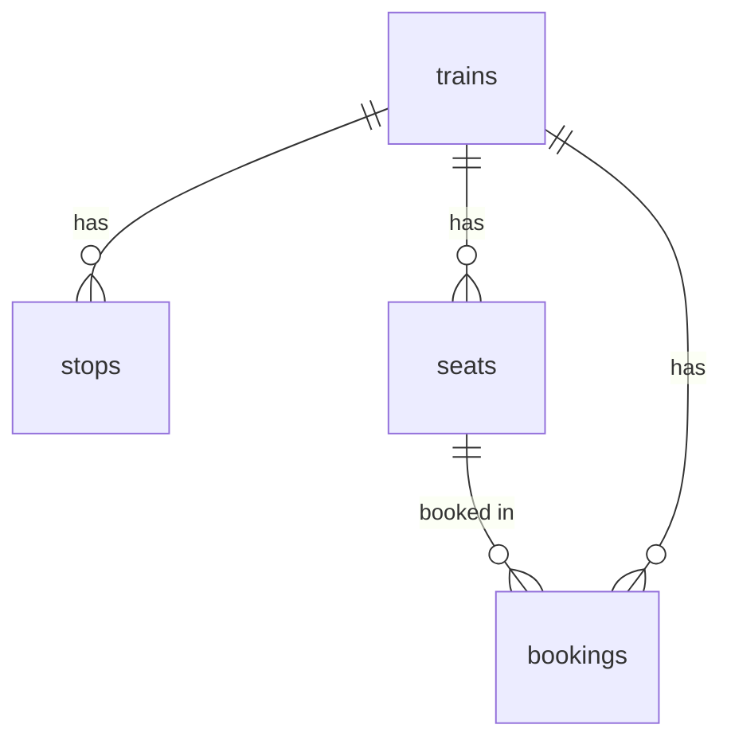

# 🚂 Train Booking API - Backend System

[](https://nodejs.org/)
[](https://expressjs.com/)
[](https://www.mysql.com/)
[](https://railway.app/)

Backend API system untuk aplikasi booking tiket kereta api dengan fitur **date-based booking** dan **gender-based seating**.

---

## 📋 Table of Contents

- [Features](#-features)
- [Tech Stack](#-tech-stack)
- [Database Structure](#-database-structure)
- [API Endpoints](#-api-endpoints)
- [Installation](#-installation)
- [Environment Variables](#-environment-variables)
- [Migration Guide](#-migration-guide)
- [Usage Examples](#-usage-examples)
- [Deployment](#-deployment)
- [Documentation](#-documentation)

---

## ✨ Features

### 🎯 Core Features
- ✅ **Date-Based Booking System** - Kursi dapat di-book untuk tanggal berbeda
- ✅ **Gender-Based Seating** - Visual indicator untuk kursi perempuan (pink seats)
- ✅ **Multi-Train Search** - Cari kereta berdasarkan stasiun asal & tujuan
- ✅ **Real-time Seat Availability** - Check kursi tersedia per tanggal
- ✅ **Temporary Seat Hold** - Pending status untuk booking sementara
- ✅ **Booking Confirmation** - Confirm & update status ke 'paid'
- ✅ **Booking History** - Track semua transaksi user

### 🔐 Data Management
- ✅ Normalized database structure (master vs transaction data)
- ✅ Proper indexing untuk fast query
- ✅ Foreign key constraints
- ✅ Backup & restore capabilities

---

## 🛠 Tech Stack

**Backend:**
- Node.js 18.x
- Express.js 5.1.0
- MySQL2 (with Promise support)
- CORS enabled

**Database:**
- MySQL 9.4.0
- Hosted on Railway

**Deployment:**
- Railway Platform
- Auto-deploy from GitHub

---

## 🗄️ Database Structure

### Tables Overview

```
trains (251 rows)
├── id_kereta (PK)
├── nama_kereta
├── kelas
├── is_pso
└── harga_*

stops (3,770 rows)
├── id_stop (PK)
├── id_kereta (FK)
├── kode_stasiun
├── urutan
└── waktu_*

seats (61,050 rows) - Master Data
├── id_kursi (PK)
├── id_kereta (FK)
├── nama_gerbong
└── nomor_kursi

bookings - Transaction Data
├── id_booking (PK)
├── id_kereta (FK)
├── tanggal_keberangkatan ⭐ NEW
├── id_kursi (FK)
├── kode_booking (UNIQUE)
├── nama_penumpang
├── id_number
├── total_harga
├── status_pembayaran
├── gender ⭐ NEW
└── timestamps
```

### Key Relationships



---

## 🚀 API Endpoints

### 1. Search Trains

```http
GET /search?from={kode_stasiun}&to={kode_stasiun}&date={YYYY-MM-DD}
```

**Query Parameters:**
- `from` (required): Kode stasiun asal (e.g., "BD" untuk Bandung)
- `to` (required): Kode stasiun tujuan (e.g., "GMR" untuk Gambir)
- `date` (optional): Tanggal keberangkatan (default: hari ini)

**Response:**
```json
{
  "message": "Kereta ditemukan!",
  "count": 5,
  "date": "2025-11-25",
  "data": [
    {
      "id_kereta": "KA1",
      "nama_kereta": "Argo Bromo Anggrek",
      "kelas": "Eksekutif",
      "is_pso": false,
      "harga_pso": null,
      "harga_total_full": 150000,
      "durasi_total_full": 180,
      "jadwalBerangkat": "06:00:00",
      "jadwalTiba": "09:00:00",
      "durasi_segmen_menit": 180,
      "sisaTiket": 197
    }
  ]
}
```

---

### 2. Get Available Seats

```http
GET /seats/{id_kereta}?date={YYYY-MM-DD}
```

**Parameters:**
- `id_kereta` (required): ID kereta
- `date` (optional): Tanggal keberangkatan (default: hari ini)

**Response:**
```json
{
  "id_kereta": "KA1",
  "tanggal_keberangkatan": "2025-11-25",
  "total_seats": 200,
  "available_seats": 197,
  "booked_seats": 3,
  "gerbong": {
    "Eksekutif 1": [
      {
        "id_kursi": 1,
        "nomor_kursi": "A1",
        "nama_gerbong": "Eksekutif 1",
        "is_booked": true,
        "booked_by": "Jane Doe",
        "gender": "Perempuan"
      },
      {
        "id_kursi": 2,
        "nomor_kursi": "A2",
        "nama_gerbong": "Eksekutif 1",
        "is_booked": false,
        "booked_by": null,
        "gender": null
      }
    ]
  }
}
```

---

### 3. Book Seats (Temporary Hold)

```http
POST /seats/book
```

**Request Body:**
```json
{
  "id_kereta": "KA1",
  "tanggal_keberangkatan": "2025-11-25",
  "seat_ids": [1, 2, 3],
  "seat_details": [
    {
      "id_kursi": 1,
      "nomor_kursi": "A1",
      "nama_gerbong": "Eksekutif 1",
      "gender": "Perempuan"
    },
    {
      "id_kursi": 2,
      "nomor_kursi": "A2",
      "nama_gerbong": "Eksekutif 1",
      "gender": "Perempuan"
    }
  ]
}
```

**Response:**
```json
{
  "message": "Kursi berhasil di-booking sementara!",
  "booking_code": "BK-1732435200000",
  "expires_at": "2025-11-25T10:15:00.000Z",
  "seats_booked": 2
}
```

---

### 4. Release Seats

```http
POST /seats/release
```

**Request Body:**
```json
{
  "seat_ids": [1, 2, 3],
  "tanggal_keberangkatan": "2025-11-25"
}
```

**Response:**
```json
{
  "message": "Kursi berhasil di-release!",
  "seats_released": 2
}
```

---

### 5. Confirm Booking

```http
POST /bookings/confirm
```

**Request Body:**
```json
{
  "id_kereta": "KA1",
  "tanggal_keberangkatan": "2025-11-25",
  "seat_ids": [1, 2],
  "passenger_data": [
    {
      "seat_id": 1,
      "nama_penumpang": "Jane Doe",
      "id_number": "3201234567890123"
    },
    {
      "seat_id": 2,
      "nama_penumpang": "John Doe",
      "id_number": "3201234567890124"
    }
  ],
  "total_price": 300000
}
```

**Response:**
```json
{
  "message": "Booking berhasil dikonfirmasi!",
  "booking_code": "BK-1732435200000",
  "total_passengers": 2,
  "total_price": 300000,
  "status": "paid"
}
```

---

### 6. Booking History

```http
GET /bookings/history?kode_booking={booking_code}
```

**Query Parameters:**
- `kode_booking` (optional): Filter by booking code

**Response:**
```json
{
  "message": "Riwayat booking ditemukan!",
  "count": 2,
  "data": [
    {
      "id_booking": 1,
      "id_kereta": "KA1",
      "tanggal_keberangkatan": "2025-11-25",
      "nomor_kursi": "A1",
      "nama_gerbong": "Eksekutif 1",
      "kode_booking": "BK-1732435200000",
      "nama_penumpang": "Jane Doe",
      "id_number": "3201234567890123",
      "total_harga": 150000,
      "status_pembayaran": "paid",
      "gender": "Perempuan",
      "created_at": "2025-11-24T10:00:00.000Z"
    }
  ]
}
```

---

## 💻 Installation

### Prerequisites
- Node.js 18.x or higher
- MySQL 8.0 or higher
- Git

### Local Setup

1. **Clone Repository**
```bash
git clone https://github.com/i7i7s/kereta-api.git
cd kereta-api
```

2. **Install Dependencies**
```bash
npm install
```

3. **Setup Environment Variables**
```bash
# Create .env file
cp .env.example .env

# Edit .env with your database credentials
```

4. **Run Database Migration**
```bash
mysql -u root -p < migration_date_based_booking.sql
```

5. **Start Server**
```bash
node index.js
```

Server will run on `http://localhost:3000`

---

## 🔐 Environment Variables

```env
# Database Configuration
MYSQLHOST=localhost
MYSQLPORT=3306
MYSQLUSER=root
MYSQLPASSWORD=your_password
MYSQLDATABASE=kereta_api

# Server Configuration
PORT=3000
```

### Railway Deployment Variables
Railway automatically provides these variables:
- `MYSQLHOST`
- `MYSQLPORT`
- `MYSQLUSER`
- `MYSQLPASSWORD`
- `MYSQLDATABASE`

---

## 📦 Migration Guide

### From Old System to Date-Based Booking

**What Changed:**

1. **Database Schema**
   - ✅ Added `tanggal_keberangkatan` to `bookings` table
   - ✅ Added `gender` to `bookings` table
   - ✅ Removed `is_booked`, `booked_at`, `gender` from `seats` table

2. **API Behavior**
   - ✅ All POST endpoints now **require** `tanggal_keberangkatan`
   - ✅ GET endpoints accept optional `date` parameter (default: today)

3. **Database Objects**
   - ✅ Dropped old triggers
   - ✅ Updated stored procedure: `release_expired_seats()`
   - ✅ Updated view: `v_seat_availability`

**Migration Steps:**

```sql
-- 1. Backup existing data
CREATE TABLE seats_backup AS SELECT * FROM seats;
CREATE TABLE bookings_backup AS SELECT * FROM bookings;

-- 2. Run migration
SOURCE migration_date_based_booking.sql;

-- 3. Verify migration
SELECT COUNT(*) FROM seats;  -- Should be 61,050
SELECT COUNT(*) FROM bookings WHERE tanggal_keberangkatan IS NOT NULL;
```

**📖 Complete Migration Guide:** See `migration_date_based_booking.sql`

---

## 📖 Usage Examples

### Example 1: Search & Book Flow

```javascript
// 1. Search trains
const searchResponse = await fetch(
  'http://localhost:3000/search?from=BD&to=GMR&date=2025-11-25'
);
const trains = await searchResponse.json();

// 2. Get available seats
const seatsResponse = await fetch(
  'http://localhost:3000/seats/KA1?date=2025-11-25'
);
const seats = await seatsResponse.json();

// 3. Book seats (temporary)
const bookResponse = await fetch('http://localhost:3000/seats/book', {
  method: 'POST',
  headers: { 'Content-Type': 'application/json' },
  body: JSON.stringify({
    id_kereta: 'KA1',
    tanggal_keberangkatan: '2025-11-25',
    seat_ids: [1, 2],
    seat_details: [
      { id_kursi: 1, nomor_kursi: 'A1', nama_gerbong: 'Eksekutif 1', gender: 'Perempuan' }
    ]
  })
});

// 4. Confirm booking
const confirmResponse = await fetch('http://localhost:3000/bookings/confirm', {
  method: 'POST',
  headers: { 'Content-Type': 'application/json' },
  body: JSON.stringify({
    id_kereta: 'KA1',
    tanggal_keberangkatan: '2025-11-25',
    seat_ids: [1, 2],
    passenger_data: [
      { seat_id: 1, nama_penumpang: 'Jane Doe', id_number: '3201234567890123' }
    ],
    total_price: 300000
  })
});
```

### Example 2: Multi-Date Booking

```javascript
// Same seat, different dates - BOTH will succeed! ✅

// Book seat A1 for November 25
await fetch('http://localhost:3000/seats/book', {
  method: 'POST',
  body: JSON.stringify({
    id_kereta: 'KA1',
    tanggal_keberangkatan: '2025-11-25',
    seat_ids: [1]
  })
});

// Book seat A1 for November 26
await fetch('http://localhost:3000/seats/book', {
  method: 'POST',
  body: JSON.stringify({
    id_kereta: 'KA1',
    tanggal_keberangkatan: '2025-11-26',
    seat_ids: [1]
  })
});

// Result:
// - Nov 25: Seat A1 = BOOKED ✅
// - Nov 26: Seat A1 = BOOKED ✅
// - Nov 27: Seat A1 = AVAILABLE ✅
```

---

## 🚀 Deployment

### Railway Deployment

1. **Push to GitHub**
```bash
git add .
git commit -m "feat: your changes"
git push origin main
```

2. **Railway Auto-Deploy**
   - Railway automatically detects changes
   - Builds and deploys new version
   - Updates environment variables
   - Restarts service

3. **Check Deployment**
```bash
curl https://your-railway-url.railway.app/search?from=BD&to=GMR
```

### Manual Deployment

```bash
# Production build
npm install --production

# Start with PM2
pm2 start index.js --name "train-api"
pm2 save
pm2 startup
```

---

## 📚 Documentation

### Additional Guides

| Document | Description |
|----------|-------------|
| `README_DATE_BASED_BOOKING.md` | Complete overview of date-based booking system |
| `FLUTTER_MIGRATION_GUIDE.md` | Step-by-step Flutter app integration guide |
| `README_GENDER_FEATURE.md` | Gender-based seating feature documentation |
| `migration_date_based_booking.sql` | Database migration script with rollback |

### Database Queries

**Check seat availability by date:**
```sql
SELECT s.id_kursi, s.nomor_kursi,
       CASE WHEN b.id_booking IS NOT NULL THEN 1 ELSE 0 END as is_booked,
       b.gender
FROM seats s
LEFT JOIN bookings b 
  ON s.id_kursi = b.id_kursi 
  AND b.tanggal_keberangkatan = '2025-11-25'
  AND b.status_pembayaran IN ('pending', 'paid')
WHERE s.id_kereta = 'KA1'
LIMIT 10;
```

**Get bookings by date:**
```sql
SELECT b.*, s.nomor_kursi, s.nama_gerbong
FROM bookings b
JOIN seats s ON b.id_kursi = s.id_kursi
WHERE b.tanggal_keberangkatan = '2025-11-25'
ORDER BY b.created_at DESC;
```

**Cleanup old bookings:**
```sql
DELETE FROM bookings 
WHERE tanggal_keberangkatan < DATE_SUB(CURDATE(), INTERVAL 7 DAY)
  AND status_pembayaran = 'cancelled';
```

---

## 🧪 Testing

### Test Scenarios

```bash
# Test 1: Search trains
curl "http://localhost:3000/search?from=BD&to=GMR&date=2025-11-25"

# Test 2: Get seats
curl "http://localhost:3000/seats/KA1?date=2025-11-25"

# Test 3: Book seats
curl -X POST http://localhost:3000/seats/book \
  -H "Content-Type: application/json" \
  -d '{
    "id_kereta": "KA1",
    "tanggal_keberangkatan": "2025-11-25",
    "seat_ids": [1],
    "seat_details": [{"id_kursi": 1, "nomor_kursi": "A1", "nama_gerbong": "Eksekutif 1", "gender": "Perempuan"}]
  }'

# Test 4: Confirm booking
curl -X POST http://localhost:3000/bookings/confirm \
  -H "Content-Type: application/json" \
  -d '{
    "id_kereta": "KA1",
    "tanggal_keberangkatan": "2025-11-25",
    "seat_ids": [1],
    "passenger_data": [{"seat_id": 1, "nama_penumpang": "Test User", "id_number": "1234567890123456"}],
    "total_price": 150000
  }'
```

---

## 🎯 Key Features Explained

### 1. Date-Based Booking System

**Problem Solved:**
- ❌ **Before:** Seats remained booked forever across all dates
- ✅ **After:** Seats are booked per specific departure date

**How It Works:**
```sql
-- Seats table = Master data (no booking status)
-- Bookings table = Transaction data (with departure date)

SELECT s.*, 
       CASE WHEN b.id_booking IS NOT NULL THEN 1 ELSE 0 END as is_booked
FROM seats s
LEFT JOIN bookings b 
  ON s.id_kursi = b.id_kursi 
  AND b.tanggal_keberangkatan = '2025-11-25'  -- ✅ Date filter!
```

### 2. Gender-Based Seating

**Features:**
- ✅ Pink seats untuk penumpang perempuan
- ✅ Gender stored in bookings (bukan di seats)
- ✅ Privacy-focused (gender only visible when booked)

**Frontend Integration:**
```dart
// Flutter code example
Color getSeatColor(Seat seat) {
  if (seat.isBooked && seat.gender == 'Perempuan') {
    return Colors.pink.shade100;  // Pink for female
  }
  return Colors.grey;  // Default color
}
```

### 3. Temporary Seat Hold

**Flow:**
1. User selects seats → `POST /seats/book` (status: pending)
2. User fills passenger data → Seats held for 10 minutes
3. User confirms payment → `POST /bookings/confirm` (status: paid)
4. If timeout → Seats automatically released

---

## ⚠️ Important Notes

### Breaking Changes

**POST endpoints now REQUIRE `tanggal_keberangkatan`:**
```javascript
// ❌ This will fail:
POST /seats/book
{ "seat_ids": [1, 2] }

// ✅ This will succeed:
POST /seats/book
{ 
  "tanggal_keberangkatan": "2025-11-25",
  "seat_ids": [1, 2] 
}
```

### Backward Compatibility

**GET endpoints are backward compatible:**
```javascript
// Both work - default to today if date not provided
GET /search?from=BD&to=GMR
GET /search?from=BD&to=GMR&date=2025-11-25
```

---

## 🤝 Contributing

1. Fork the repository
2. Create feature branch (`git checkout -b feature/AmazingFeature`)
3. Commit changes (`git commit -m 'Add some AmazingFeature'`)
4. Push to branch (`git push origin feature/AmazingFeature`)
5. Open Pull Request

---

## 📄 License

This project is licensed under the ISC License.

---

## 👥 Authors

- **Backend Development** - Initial work and architecture
- **Database Design** - Schema optimization and migration

---

## 🙏 Acknowledgments

- Railway for hosting infrastructure
- Express.js community
- MySQL documentation

---

## 📞 Support

For issues and questions:
- 📧 Create an issue on GitHub
- 📖 Check documentation files
- 💬 Review closed issues for similar problems

---

## 🔄 Version History

### v2.0.0 (November 24, 2025)
- ✅ Complete refactor to date-based booking system
- ✅ Added gender-based seating feature
- ✅ Database schema migration
- ✅ Updated all API endpoints
- ✅ Comprehensive documentation

### v1.0.0 (November 11, 2025)
- ✅ Initial release
- ✅ Basic search and booking functionality
- ✅ Railway deployment setup

---

**🚀 Ready for Production!**

For complete implementation details, see:
- `README_DATE_BASED_BOOKING.md` - System overview
- `FLUTTER_MIGRATION_GUIDE.md` - Mobile app integration
- `README_GENDER_FEATURE.md` - Gender seating feature

---

**Built with ❤️ for efficient train booking**
